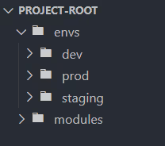
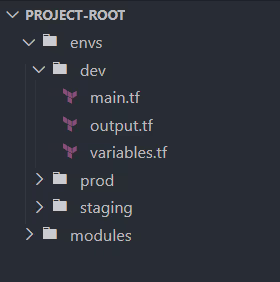
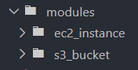
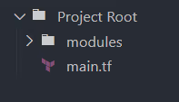

[Terraform Files and Folder Structure](https://www.env0.com/blog/terraform-files-and-folder-structure-organizing-infrastructure-as-code)


##### 1. Multi-Environment Projects

For projects that span multiple environments, it's essential to isolate the configurations for each environment to prevent unintended changes that could affect stability.

A common approach is to use separate directories for each environment within your project, such as envs/dev, envs/staging, and envs/prod.

Each directory can contain environment-specific versions of your Terraform configurations, allowing for tailored deployment strategies and parameters for each environment.

Let's create a structure allowing separate configurations for development, staging, and production environments.



Within each environment directory, add the necessary Terraform configuration files. For example, in the dev environment:



##### Organizing Terraform Modules Within a Project

Organizing Terraform modules within a project is a strategic approach to managing and reusing code across your infrastructure. This allows you to package and encapsulate resources and configurations that can be used repeatedly throughout your project.

A module in Terraform serves as a container for multiple resources to be used together, allowing for reusability and better organization of your infrastructure code.

Encapsulating related resources can simplify and make Terraform configurations more manageable, especially as projects become complex.

Within the modules directory, create a subdirectory for the S3 bucket module and another for the EC2 instance module.



Add the Terraform files that define the root module resources, input variable values, and outputs inside each root module's directory.


Call the root modules defined in your main project files or within environment-specific directories.



Calling the S3 Bucket Module:
```
module "app_s3_bucket" {
source = "./modules/s3_bucket"
bucket_name = "my-app-bucket" acl = "private"
}
```


Calling the EC2 Instance Module:
```
module "app_instance" {
source = "./modules/ec2_instance"
instance_type = "t2.micro"
ami = "ami-7549540092"
}
```


